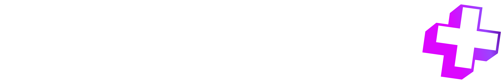

**Core Logo - On Dark**

<Frame as="div">
  
</Frame>

**Core Logo - On Light**

<Frame as="div">
  
</Frame>

<CardGroup cols="4">
  <Card img="/media-kit/Core-logomark.png">
    **Core Logomark**
  </Card>

  <Card img="/media-kit/knock-out-logomark-on-dark.png">
    **Knockout On Dark**
  </Card>

  <Card img="/knockout-logomark-on-light.png">
    **Knockout On Light**
  </Card>
</CardGroup>

<CardGroup cols="4">
  <Card img="/media-kit/Rectangle 1.png">
    **Primary Colorway**
    &#x9;	\#DC07FF
  </Card>

  <Card img="/media-kit/Rectangle 2.png">
    **Secondary Colorway**

    \#9A45FE
  </Card>

  <Card img="/media-kit/Rectangle 3.png">
    **Tertiary Colorway**

    \#590AA0
  </Card>
</CardGroup>