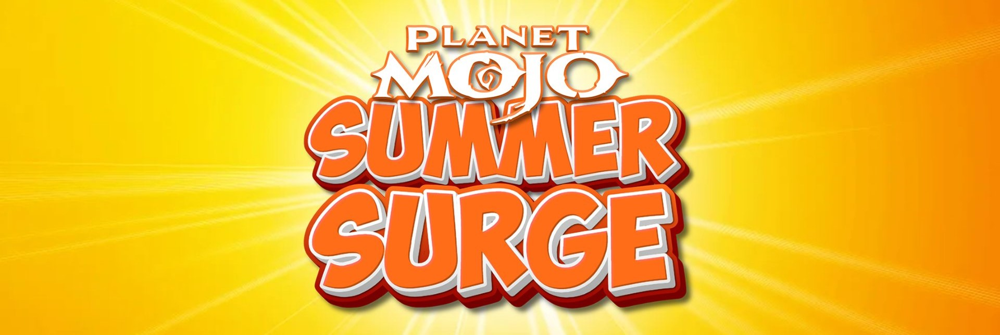

<Frame as="div">
  
</Frame>

---
title: "Planet Mojo"
description: "Mojo Madness, Frozen Fates, and The Mojo Bowl."
---

Through 6 months of working alongside the Planet Mojo team, New Game+ coordinated influencer marketing campaigns to showcase the gameplay and web3 initiatives of Mojo Melee, GoGo Mojo, and the rest of the Planet Mojo ecosystem.&#x20;

During this time, the New Game+ team developed campaign strategies for the three campaign flights, negotiated pricing with content creators, coordinated deliverables, established communications and executed the campaigns.

Considering the negotiated price points for these influencers, all of the participants were committed to delivering quality content across multiple platforms and genuinely interested in the gameplay. A number of creators went above and beyond the asked deliverables to make uniquely creative content.

<CardGroup cols={2}>
  <Card title="$85,000" icon="money-bill-transfer">
    Total Spend
  </Card>

  <Card title="18,456+" icon="arrow-pointer">
    Total Clicks
  </Card>
</CardGroup>

<CardGroup cols={3}>
  <Card title="258+" icon="video">
    Content Distributed
  </Card>

  <Card title="675,000+" icon="eye">
    Total Impressions
  </Card>

  <Card title="45,300+" icon="comment">
    Total Engagement
  </Card>
</CardGroup>