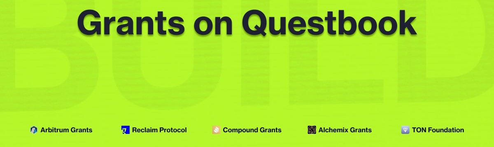

<Frame as="div">
  
</Frame>

Over the span of three months, New Game+ was tasked with allocating 37,500 USD from the Arbitrum Foundation grant to oversee influencer campaigns, live experiences, and content strategy advising. &#x20;

Each month, our target was to generate 15,000 click-throughs, with a total spend management of 100,000 USD approved by the Questbook Council.

In the 3-month period, our team engaged with every major web3 gaming ecosystem and studio on Arbitrum. Our solution was to offer New Game+ as a strategy partner, developing creative approaches and managing creators, organizations, and events for their upcoming releases.

At the time of this report being written, the New Game+ team has worked with and is currently working with a total of 15 teams that held an event in the past month or plan to launch an event in the next month. The full list is below:

|                          |                   |                |
| ------------------------ | ----------------- | -------------- |
| **Knights of the Ether** | **Valeria Games** | **KittyKart**  |
| **Zeeverse**             | **Footium**       | **The Beacon** |
| **Dininho**              | **Loot Legends**  | **Bitmates**   |
| **The Lost Glitches**    | **MAYG**          | **InfiniGods** |
| **Aurory**               | **SOKAN 404**     | **Smithonia**  |

<CardGroup cols={2}>
  <Card title="$275,000" icon="money-bill-transfer">
    Total Spend
  </Card>

  <Card title="99,000" icon="arrow-pointer">
    Total Clicks
  </Card>
</CardGroup>

<CardGroup cols={3}>
  <Card title="235" icon="video">
    Content Distributed
  </Card>

  <Card title="550,000" icon="eye">
    Total Impressions
  </Card>

  <Card title="65,000" icon="comment">
    Total Engagement
  </Card>
</CardGroup>